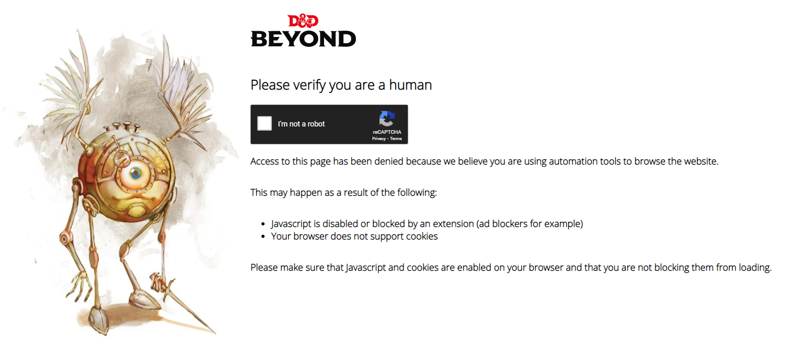

# dndbeyond-api-extension

A prototype for a Chrome extension to allow your web app access to your D&D
Beyond content.

## Caveats

**TL;DR** This is an egregious hack.

The very idea this is based upon (programmaticallyextracting data from rendered
web pages) is very fragile. It's also something that most web pages don't want
you to do, so you're likely to start getting captchas to prevent it:



Using this for an actual user-facing product (or anything that you need to not
break) is highly discouraged. Because of this, the code's quality is admittedly
not great either.

## Usage

Methods in this library return [Promises](https://developer.mozilla.org/en-US/docs/Web/JavaScript/Reference/Global_Objects/Promise) containing the requested data.

**Example usage:**

```js
dndBeyond.searchMonsters('goblin').then(
  searchResults => displaySearchResults(searchResults));

dndBeyond.getMonsterFromUrl('https://www.dndbeyond.com/monsters/goblin').then(
  monsterData => displayMonster(monsterData));
```

## Setup

1. **Update `crx/manifest.json`, the manifest of the Chrome extension.**

   Make sure you replace all instances of `YOUR_APP`, `YOUR_DOMAIN`, etc. with
   the proper values, and also alter any title/name text you wish.
   
2. **[Load](https://developer.chrome.com/extensions/getstarted#manifest) the
   `crx` folder as an "unpacked extension" in Chrome.**
   
   Make sure your take note of the extension's *ID* when it's been loaded.
   You'll need it for the next step.

3. **Update `dndbeyond.js`, the proxy script you use in your web app.**

   Put your extension's ID in the `CHROME_EXTENSION_ID` constant near the top of
   the file.

4. Include the updated `dndbeyond.js` script in your page and start using it!
